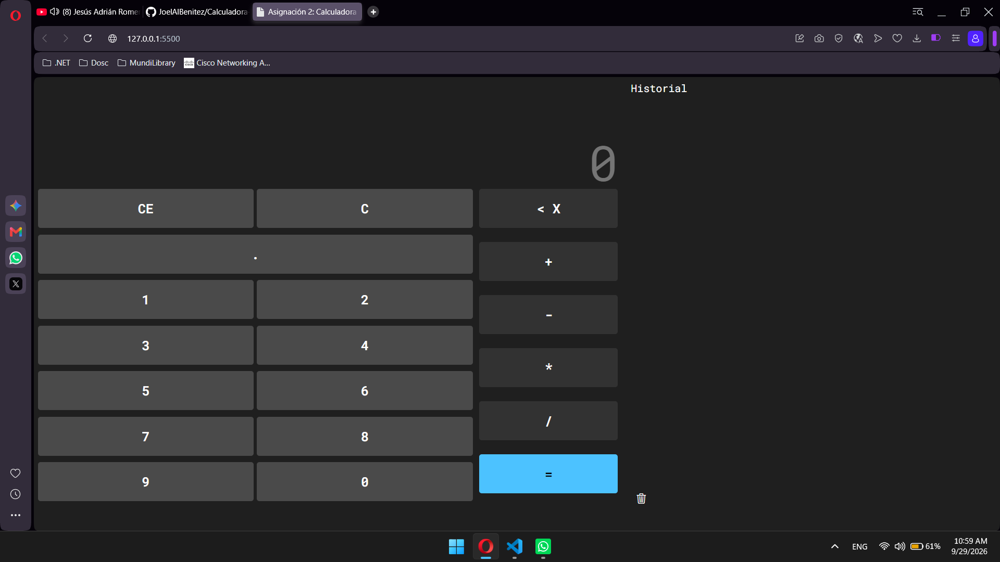
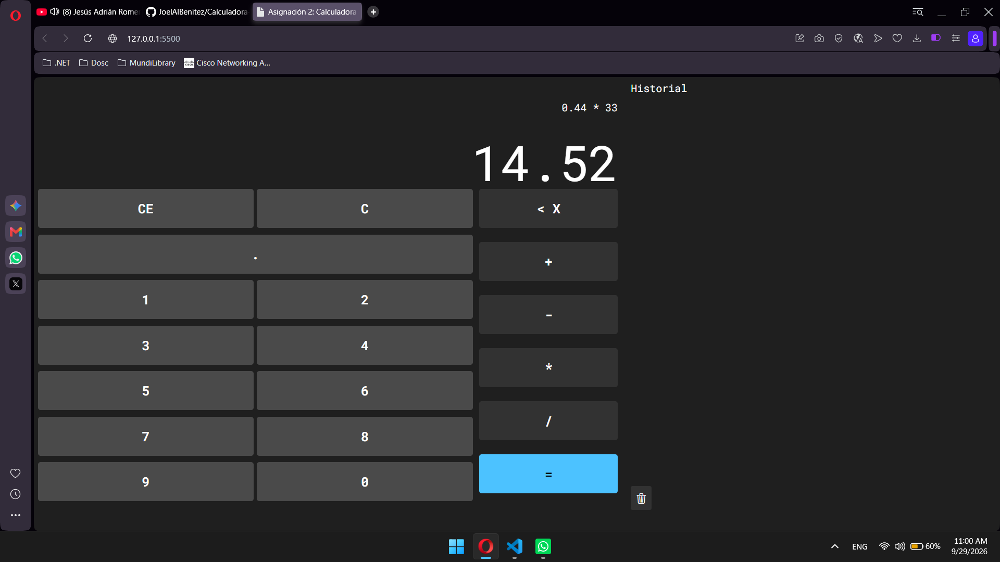
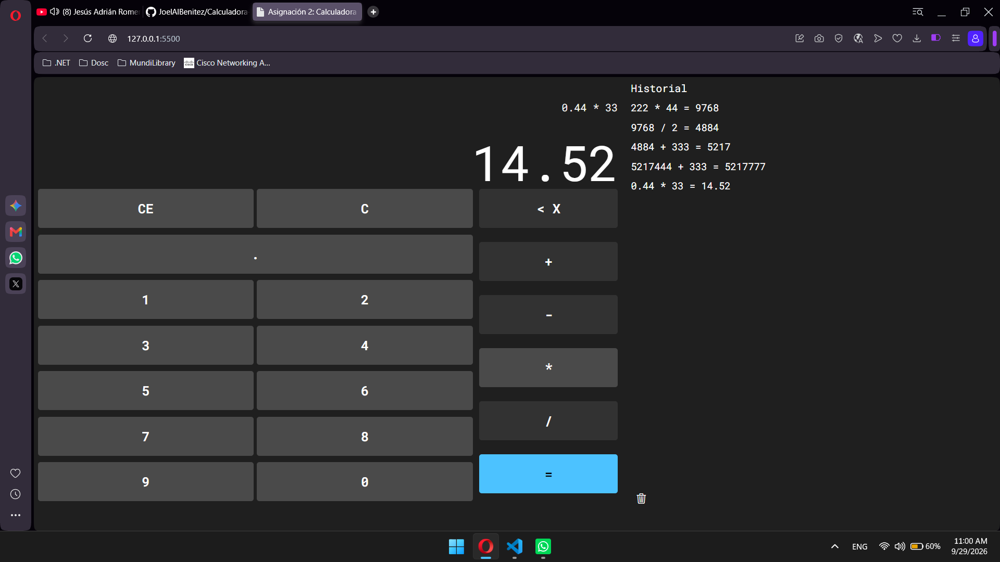
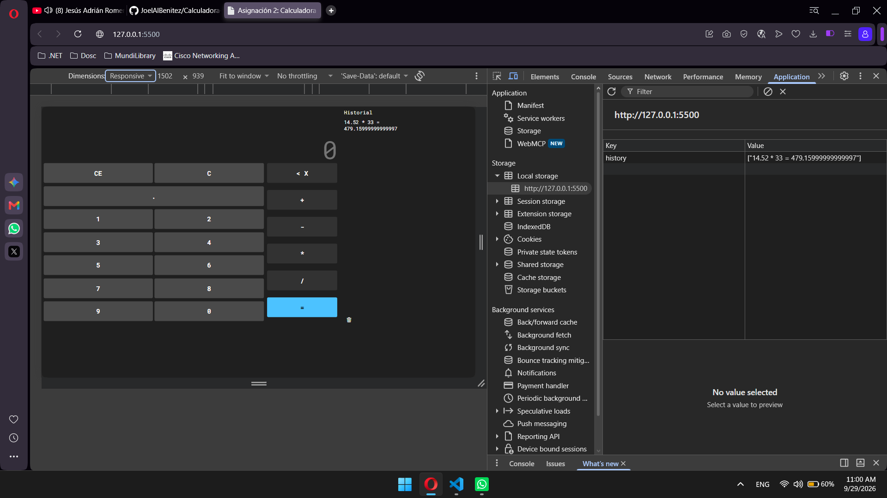

# Calculadora-Asignatura-Programacion-Web

Esta es una calculadora web, donde se realizan las operaciones aritméticas básicas desarrollada como segunda asignación de la asignatura de `Programación Web` por parte del estudiante `Joel Alberto Benitez Varela`. 
La misma fue desarrollada con las siguientes tecnologías:
<ul>
  <li>HTML 5</li>
  <li>CSS 3</li>
  <li>JavaScript</li>
</ul>

Segunda asignación de  la asignatura de Programación Web - Instituto Tecnológico de las Américas ITLA.

## Captures

Apartado principal del sistema: 

Muestra de operaciones aritmeticas: 

Historial

